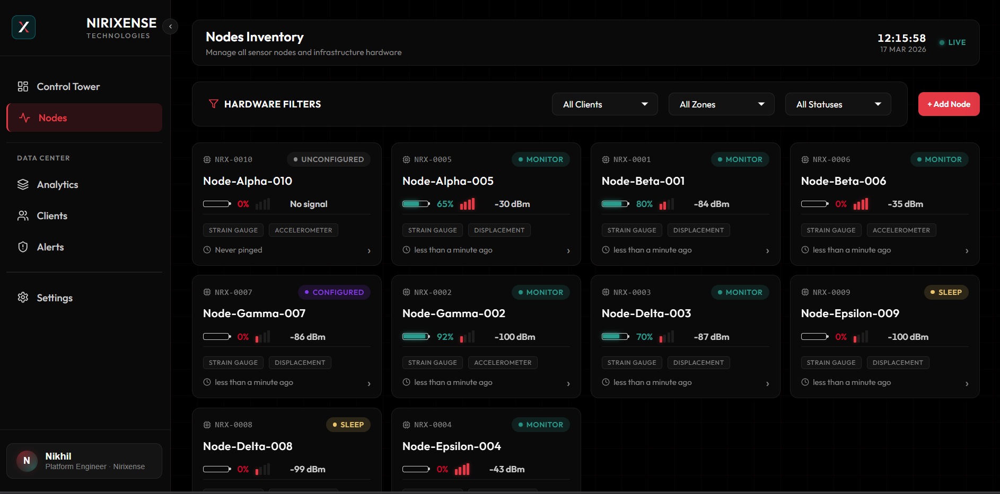
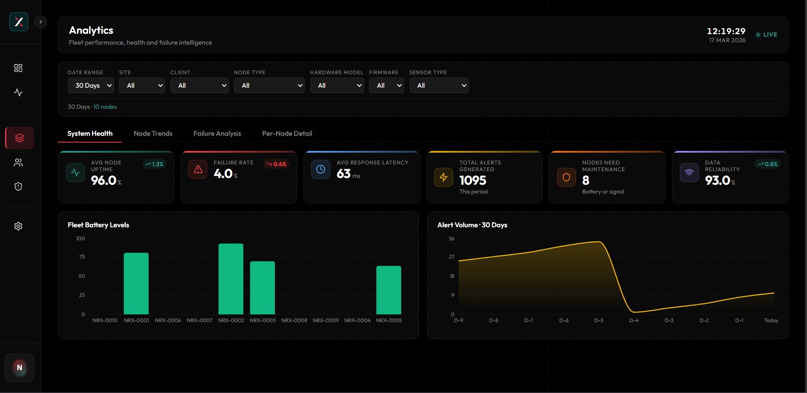
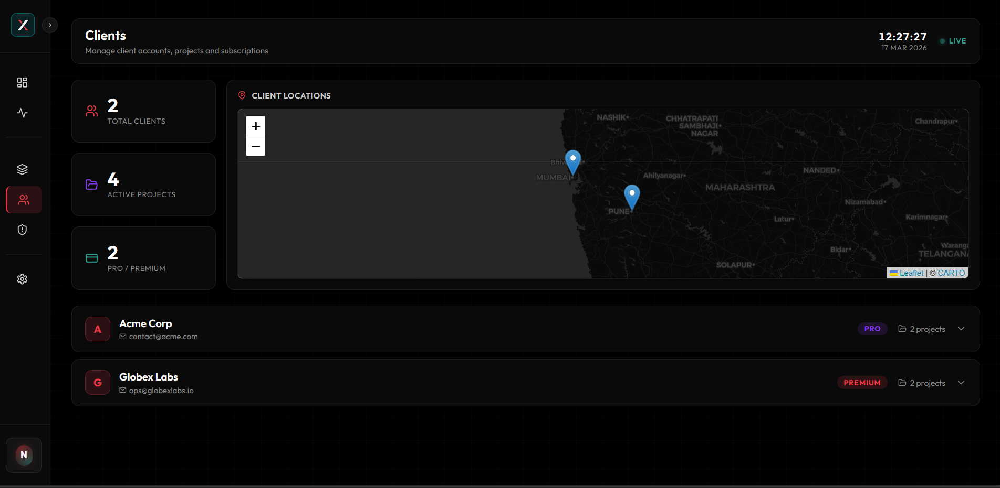
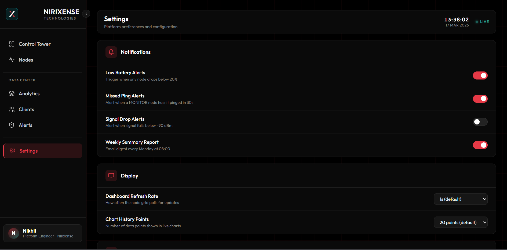
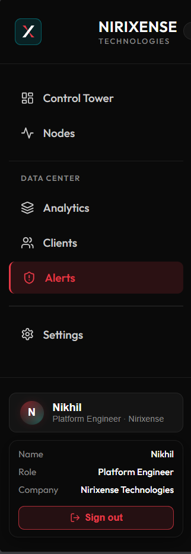
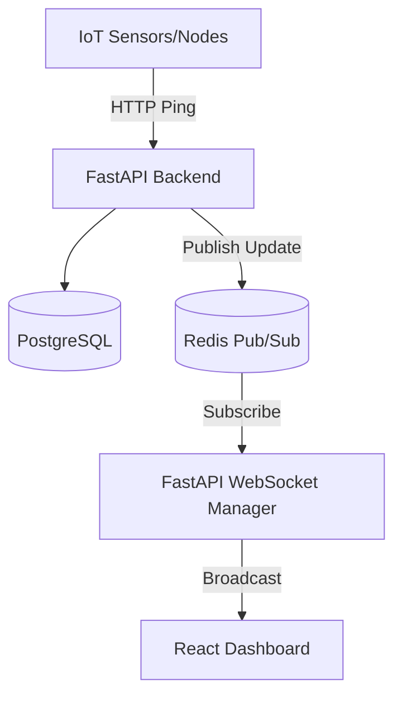

# Nirixense SHM Platform

Full-stack Structural Health Monitoring platform with real-time updates and analytics.

## Screenshots

  <h3>Control Tower</h3>
  

### Node Details & Deep Insights

   &nbsp;&nbsp;&nbsp;&nbsp; 

### Analytics

   &nbsp;&nbsp;&nbsp;&nbsp; 

### Alerts

   &nbsp;&nbsp;&nbsp;&nbsp; 

### Clients & Settings

   &nbsp;&nbsp;&nbsp;&nbsp; 

<!-- 

  <h3>Sidebar</h3>
  

 -->

## Tech Stack
- **Backend:** FastAPI, Python, SQLAlchemy, PostgreSQL, Redis (Pub/Sub + Caching), Alembic
- **Frontend:** React, Vite, Recharts, Lucide-react
- **Infrastructure:** Docker, Docker Compose

## Architecture Overview

## Features
- **Real-Time Dashboard:** WebSocket streams node status (battery, signal) instantly without reloading.
- **Node Lifecycle Engine:** State machines for NOT_CONFIGURED → CONFIGURED → MONITOR → SLEEP.
- **Analytics Tier:** Advanced signal processing simulated with tier-gating (Basic vs Premium).
- **Responsive UI:** Dark theme, glassmorphism, brand matching (red/black).

## Quick Start

For a detailed walkthrough on setting up the platform (Docker + Native), see:
👉 **[SETUP.md](./SETUP.md)**

### Short Version:
1. `docker-compose up -d db redis`
2. Setup Python venv in `backend/` & `pip install -r requirements.txt`
3. `npm install` in `frontend/`
4. Run `start_platform.bat`

## Current App Structure (since last push)

### Backend
- **Service layout**
  - `backend/app/main.py` – FastAPI entrypoint, router registration, WebSocket endpoint.
  - `backend/app/models.py` / `backend/app/schemas.py` – SQLAlchemy models and Pydantic schemas for nodes, sensors, projects, zones, clients, alerts, etc.
  - `backend/app/database.py` – PostgreSQL engine and session handling.
  - `backend/app/redis_client.py` – Redis connection + pub/sub utilities.
  - `backend/app/websocket_manager.py` – manages live WebSocket connections and broadcasting of node events to the frontend.
  - `backend/app/enums.py` – lifecycle and other enums (NOT_CONFIGURED → CONFIGURED → MONITOR → SLEEP, etc.).

- **Routers (REST API)**
  - `backend/app/routers/nodes.py` – node lifecycle + status ingestion and querying.
  - `backend/app/routers/sensors.py`, `backend/app/routers/zones.py`, `backend/app/routers/projects.py`, `backend/app/routers/clients.py` – CRUD and associations around the SHM domain model.
  - `backend/app/routers/analytics.py` – analytics tier endpoints (Basic vs Premium).
  - `backend/app/routers/subscriptions.py` & related alert flows – subscription-style endpoints for alerting and streaming.
  - `backend/app/routers/data_files.py` – data-file related utilities (import/export).

- **Ops & tooling**
  - `backend/alembic.ini` & `backend/alembic/` – Alembic migrations.
  - `backend/requirements.txt` – backend dependencies for Docker and local dev.
  - `backend/simulator.py` / `backend/reseed.py` – local data seeding and node simulation for demos.

### Frontend
- **Core shell**
  - `frontend/src/main.jsx` – React entrypoint bootstrapped with Vite.
  - `frontend/src/App.jsx` – top‑level routing and layout wiring.
  - `frontend/src/index.css` – global theme tokens (dark background, red/emerald accents, glassmorphism).

- **Layout**
  - `frontend/src/layout/Sidebar.jsx` – left navigation with Control Tower, Nodes, Analytics, Clients, Alerts, Settings; includes a user account section for **Nikhil** with role and company, replacing the previous sidebar LIVE pill.
  - `frontend/src/layout/TopBar.jsx` – page title area with clock and connection status (Live / Connecting) driven by WebSocket state.
  - `frontend/src/layout/DashboardLayout.jsx` – main two‑pane layout combining sidebar, top bar, and routed content.

- **Pages**
  - `frontend/src/pages/Analytics.jsx` – analytics charts and tiered insight views.
  - `frontend/src/pages/Alerts.jsx` – alert list, timeline helpers (`alertsHelpers.js`), and status filtering.
  - `frontend/src/pages/NodesList.jsx` – tabular node list view complementary to the card/grid dashboard.
  - `frontend/src/pages/Clients.jsx` – client / project management surface.
  - `frontend/src/pages/Settings.jsx` – configuration and platform settings.

- **Dashboard components**
  - `frontend/src/components/Dashboard.jsx` – main Control Tower view aggregating KPIs and charts.
  - `frontend/src/components/NodeCard.jsx`, `frontend/src/components/NodeDrawer.jsx`, `frontend/src/components/NodeFilters.jsx`, `frontend/src/components/NodeZoneMap.jsx` – node‑level views (cards, details drawer, filtering, zone map).
  - `frontend/src/components/Charts.jsx` – Recharts‑based time‑series and distribution charts.
  - `frontend/src/components/EventTimeline.jsx` – chronological event stream for alerts and status changes.
  - `frontend/src/components/MaintenanceInsights.jsx` – surfaced maintenance suggestions/intelligence.
  - `frontend/src/components/StatCard.jsx` – reusable KPI/stat tiles.
  - `frontend/src/hooks/useWebSocket.js` – shared WebSocket hook used by the dashboard and top bar to subscribe to backend node updates.

### Developer Utilities
- **Docker & scripts**
  - `docker-compose.yml` – orchestrates backend, PostgreSQL, Redis, and frontend.
  - `backend/Dockerfile` / `Dockerfile.bak` – backend container build definitions.
  - `start_platform.bat` / `stop_platform.bat` – Windows helpers to start/stop the full stack.

- **Type checking & project config**
  - `pyproject.toml`, `pyrightconfig.json`, `backend/pyrightconfig.json` – Python packaging and static analysis configuration.

This README reflects the current layout and major features after the latest round of backend, frontend, and UX additions (new dashboard pages, WebSocket‑driven live status, and the updated sidebar with the Nikhil account section).

