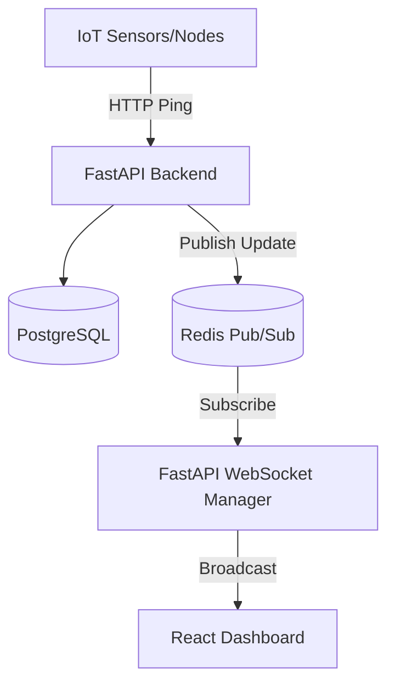

# Nirixense SHM Platform

Full-stack Structural Health Monitoring platform with real-time updates and analytics.

## Tech Stack
- **Backend:** FastAPI, Python, SQLAlchemy, PostgreSQL, Redis (Pub/Sub + Caching), Alembic
- **Frontend:** React, Vite, Recharts, Lucide-react
- **Infrastructure:** Docker, Docker Compose

## Architecture Overview

## Features
- **Real-Time Dashboard:** WebSocket streams node status (battery, signal) instantly without reloading.
- **Node Lifecycle Engine:** State machines for NOT_CONFIGURED → CONFIGURED → MONITOR → SLEEP.
- **Analytics Tier:** Advanced signal processing simulated with tier-gating (Basic vs Premium).
- **Responsive UI:** Dark theme, glassmorphism, brand matching (red/black).

## Quick Start
1. Run `docker-compose up -d --build`
2. Backend API Docs: `http://localhost:8000/docs`
3. React Frontend: `http://localhost:5173`

*(Note: Requires ports 8000, 5173, 5432, 6379 to be available)*
